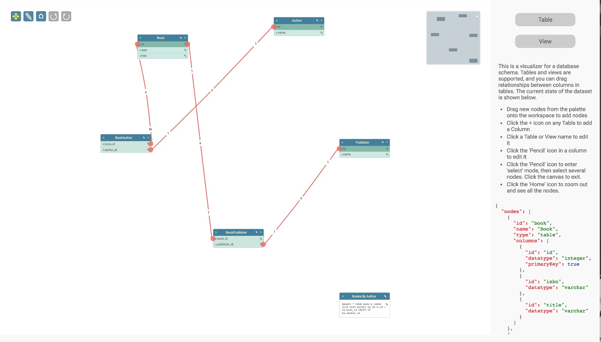

<a name="top"></a>
## Database Visualizer

This is a simple database visualizer app, offering support for Tables and Views, with the ability to establish relationships between columns using the mouse.



This page gives you an in-depth look at how the application is put together.

<a name="setup"></a>

### Page Setup

##### CSS

- **jsplumbtoolkit.css** Recommended for all apps using the Toolkit, at least when you first start to build your app. This stylesheet contains sane defaults for the various widgets in the Toolkit.
- **jsplumbtoolkit-syntax-highlighter.css** Styles for the dataset view. Not a Toolkit requirement, just used for this demonstration.
- **jsplumbtoolkit-demo-support.css** Common styles for the demonstration pages. Not a Toolkit requirement.
- **app.css** Styles specific to this demo. 

##### JS

- **jsplumbtoolkit.js**
- **jsplumbtoolkit-drop.js**
- **app.js** Application specific JS.

--- 

<a name="templates"></a>

### Templates

There are three templates used by the app - one each for the node types of `Table` and `View`, and one for the `Column` entries in a `Table`.  
The Toolkit uses [Knockle](templating#knockle) as its default templating engine, which has the ability to update previously rendered content. Note that Rotors uses a **strict** XHTML syntax; you must ensure you close off all HTML tags that you are perhaps accustomed to leaving open, such as `<input>` or `<br>`.

#### Table

```xml
<script type="jtk" id="tmplTable">
    <div class="table node">
        <div class="name">
            <div class="delete" title="Click to delete">
                <i class="fa fa-times"/>
            </div>
            <span>${name}</span>
            <div class="buttons">
                <div class="edit-name" title="Click to edit table name">
                    <i class="fa fa-pencil"/>
                </div>
                <div class="new-column add" title="Click to add a new column">
                    <i class="fa fa-plus"/>
                </div>
            </div>
        </div>
        <ul class="table-columns">
            <r-each in="columns" key="id">
                <r-tmpl id="tmplColumn"/>
            </r-each>
        </ul>
    </div>
</script>
```

In this template you can see the syntax for extracting values out of the content: `${name}`, for example. We use the 
`r-each` element to loop through the columns, and an `r-tmpl` element to nominate a template to use to render
each column. Note that we specify a `key` attribute on the `r-each` element.  If you plan on subsequently updating your
data you should ensure that you provide this, and that it returns a unique value for each column. Knockle uses it when
updating the data to figure out when to add/remove elements and when to just update existing ones.

#### View

```xml
<script type="jtk" id="tmplView">
    <div class="view node">
        <div class="name">
            <div class="view-delete" title="Click to delete">
                <i class="fa fa-times"/>
            </div>
            <span>${name}</span>
            <div class="buttons">
                <div class="edit-name" title="Click to edit view name">
                    <i class="fa fa-pencil"/>
                </div>
            </div>
        </div>
        <div class="view-edit" title="Click to edit view query">
            <i class="fa fa-pencil"/>
        </div>
        <div class="view-details">${query}</div>
    </div>
</script>
```

The view node template is more simple than the table template; just a couple of data bindings. The type of the script is arbitrary: it just needs to be something the browser won't process. jsPlumb uses `jtk` as a convention.

#### Column

```xml
<script type="jtk" id="tmplColumn">
  <li class="table-column table-column-type-${datatype}" primary-key="${primaryKey}" data-jtk-port-id="${id}">
    <div class="table-column-edit">
      <i class="fa fa-pencil table-column-edit-icon"></i>
    </div>
    <div class="table-column-delete">
      <i class="fa fa-times table-column-delete-icon"></i>
    </div>
    <div>
      <span>${name}</span>
    </div>
    <!--
      configure the li as an edge source, with a type of column, a scope derived from
      the columns datatype, and a filter that prevents dragging new edges from the delete button or from the label.
    -->
    <jtk-source port-id="${id}" port-type="column" scope="${datatype}" filter=".table-column-delete, .table-column-delete-icon, span, .table-column-edit, .table-column-edit-icon" filter-exclude="true"></jtk-source>

    <!--
      configure the li as an edge target, with a type of column, and a scope derived from the
      column's datatype.
     -->
    <jtk-target port-id="${id}" port-type="column" scope="${datatype}"></jtk-target>
  </li>
</script>
```

This template demonstrates how to use [the Toolkit's declarative connectivity constructs](templating#connectivity): `jtk-source` tells 
the Toolkit that the parent element of the `jtk-source` element (in this case, an `LI`) should act as a connection source, 
and `jtk-target` tells the Toolkit that it is also a connection target. Follow the link for a more detailed discussion of 
how to use these elements in your templates.

---

<a name="loading"></a>

### Data Loading

Data for this application is stored in `data/schema-1.json` inside the application folder. It is loaded by this code:

```javascript
toolkit.load({
  url: "data/schema-1.json"
});
```  

This is what the Book Node looks like in the example data:

```javascript
{
  "id": "book",
  "name": "Book",
  "type": "table",
  "columns": [
    {
      "id": "id",
      "datatype": "integer",
      "primaryKey": true
    },
    {
      "id": "isbn",
      "datatype": "varchar"
    },
    {
      "id": "title",
      "datatype": "varchar"
    }
  ]
}
```

Each table has `id`, `name` and `type`, as well as, usually, an array of `columns`. 

---

<a name="columns"></a>

#### Identifying Table Columns

In this demonstration we model each column in a table as a `Port`. The column information is stored in the `columns` array in
  the data backing each Node. In order to pull this data out at render time, we have specified that the `portDataProperty` has a value
  of "columns":
  
```javascript
var toolkit = jsPlumbToolkit.newInstance({
  ...
  portDataProperty: "columns"
  ...
});
```


<a name="columns-update"></a>

#### Keeping column data up to date

After having extracted the column data at load/render time, we want to ensure that we keep the `columns` array up to date
with the set of Ports on each Node.  Previous versions of this demo used a `portUpdater` function for this. Since 1.8.2, the
`portDataProperty` that we now use will create a `portUpdater` for us. 

---

<a name="dragging"></a>

### Dragging new nodes

The `SurfaceDropManager` provides a means for you to configure a set of nodes that you wish to be able to 
drag and drop into the work area. This is the code in the Database Visualizer that does this:

```javascript

var mainElement = document.querySelector("#jtk-demo-dbase"),
    canvasElement = mainElement.querySelector(".jtk-demo-canvas"),
    miniviewElement = mainElement.querySelector(".miniview"),
    nodePalette = mainElement.querySelector(".node-palette"),
    controls = mainElement.querySelector(".controls");

...


new SurfaceDropManager({
    source:nodePalette,
    selector:"[data-node-type]",
    surface:renderer,
    dataGenerator: function (el) {
        return {
            name:el.getAttribute("data-node-type"),
            type:el.getAttribute("data-node-type")
        };
    },
    allowDropOnEdge:false
});
```

- **surface** The Surface widget to attach to.  
- **dataGenerator** This function is used by the Toolkit to generate an initial dataset for a Node you have just dropped. 
- **source** DOM element containing draggable elements.
- **selector** CSS3 selector identifying draggable elements in `source`.

For more information about the SurfaceDropManager, see [this page](https://docs.jsplumbtoolkit.com/toolkit/current/articles/surface-drop-manager.html).

[TOP](#top)

---

<a name="behaviour"></a>

### Behaviour

The Toolkit publishes a long list of events during the rendering lifecycle - `nodeAdded`, `edgeAdded`, etc - all of which can be subscribed to from within a palette definition. But for your app's behaviour, it is better to use event delegation and configure all of your event listeners in one place. In the Database Visualizer there are six main pieces of behaviour we need to code that are not handled for us by the Toolkit:

- Delete Table/Delete View
- Add Column
- Edit Column
- Delete Column
- Change Table/View Name
- Edit View Query
- Edit Edge Detail

We'll go through each of these and provide a brief code snippet highlighting the main points.

#### Delete Table/Delete View

These two are actually handled by the same piece of code:

```javascript
jsPlumb.on(canvasElement, "tap", ".delete i, .view-delete i", function(e) {    
  jsPlumbUtil.consume(e);  
  var info = renderer.getObjectInfo(this);
  jsPlumbToolkit.Dialogs.show({
    id: "dlgConfirm",
    data: {
      msg: "Delete '" + info.id
    },
    onOK: function (data) {
      toolkit.removeNode(info.id);
    }
  });
});
```

Two pieces of core Toolkit functionality are used here. First, a method with which you will want to acquaint yourself: `getObjectInfo`.  This method (defined on a Surface, *not* on a Toolkit instance), takes a DOM element as argument and places it within the context of some object managed by the Toolkit instance that the renderer is associated with.  In this case, the click event occurs on an icon. `getObjectInfo` traverses up the icon's ancestors until it finds an element that is associated with a Toolkit object - in our app, either a Table or View. When a Toolkit object is found, `getObjectInfo` returns an object with these values:

- **id** ID of the Toolkit object
- **obj** The associated Toolkit object. May be a Node or a Port.
- **el** The DOM element for the Toolkit object
- **type** The type of the Toolkit object. This will be "Node" or "Port".

So in the Table/View delete handler, we first find the associated Toolkit object, and then we prompt the user to see if they wish to delete it. If the users answers yes, then we call `removeNode` on the Toolkit, passing in the ID of the object to delete. This will cause all Edges associated with the Node to be deleted, and for the UI to be updated accordingly.

This application uses the Toolkit's [dialogs](dialogs) import to manage simple interactions with data members such as this. Your application may choose to use a different mechanism.

Note also the use of the `tap` event here, rather than `click`. `tap` is a synthesized event (on non-touch devices; on touch devices it is native) whose 
purpose is to avoid spurious calls: the default behaviour of a browser with a mouse is to fire a click event even if the mouse has moved between `mousedown` and `mouseup`! 
This event is made available through [Mottle](https://github.com/jsplumb/mottle), the event manager that jsPlumb uses.

#### Add Column

```javascript
jsPlumb.on(canvasElement, "tap", ".new-column, .new-column i", function(e) {
  jsPlumbUtil.consume(e);
  var info = renderer.getObjectInfo(this);            
  jsPlumbToolkit.Dialogs.show({
    id: "dlgColumnEdit",
    title: "Column Details",
    // if the user supplied a column name, tell the toolkit to add a new port, providing it the
    // id and name of the new column.  This will result in a callback to the portFactory defined above.
    if (data.name) {
        if (data.name.length < 2)
            alert("Column names must be at least 2 characters!");
        else {
            toolkit.addNewPort(info.id, "column", {
                id: jsPlumbUtil.uuid(),
                name: data.name.replace(" ", "_").toLowerCase(),
                primaryKey: data.primaryKey,
                datatype: data.datatype
            });
        }
    }
  });
});
```

In this handler we again use `getObjectInfo` to find the Node to which the current operation applies. Then we prompt the user for a column name, and if it is longer 
than 2 characters, we register it on the Toolkit. The method used for that is `addNewPort`, whose signature is:

`addNewPort({Node|String} node, {Object} data)`

`node` can be a Node or a Node id (as in this case).  `data` is actually optional, but it is likely you'll want to provide some.

#### Edit Column

```javascript
jsPlumb.on(canvasElement, "tap", ".table-column-edit i", function(e) {
  jsPlumbUtil.consume(e);  
  var info = renderer.getObjectInfo(this);            
  jsPlumbToolkit.Dialogs.show({
    id: "dlgColumnEdit",
    title: "Column Details",
    data: info.obj.data,
    onOK: function (data) {
      // if the user supplied a column name, tell the toolkit to add a new port, providing it the
      // id and name of the new column.  This will result in a callback to the portFactory defined above.
      if (data.name) {
          if (data.name.length < 2)
              jsPlumbToolkit.Dialogs.show({id: "dlgMessage", msg: "Column names must be at least 2 characters!"});
          else {
              toolkit.updatePort(info.obj, {
                  name: data.name.replace(" ", "_").toLowerCase(),
                  primaryKey: data.primaryKey,
                  datatype: data.datatype
              });
          }
      }
    }
  });
});
```

This looks quite similar to the add column functionality: the major differences being that we pass in the column's `data` 
to the dialog, so that it may populate the UI, and we use `updatePort` in the callback.

A note here on the various `update***` methods in the Toolkit. `updateEdge` will always result in the associated connection 
being updated and repainted accordingly. Also, if you're using the Toolkit with its default template rendering mechanism, 
any calls to `updatePort` or `updateNode` will result in the data changes being reapplied to the rendered elements; this 
is because Knockle supports subsequent updates to elements it has rendered. So, in this application, it suffices for us 
to call `updatePort` on the Toolkit and we know our UI will be updated correspondingly. If, however, you use a custom template 
renderer, this will not happen for you automatically. Manual intervention will be required.


#### Delete Column

```javascript
jsPlumb.on(canvasElement, "tap", ".table-column-delete, .table-column-delete i", function (e) {
  jsPlumbUtil.consume(e);  
  var info = renderer.getObjectInfo(this);
  jsPlumbToolkit.Dialogs.show({
    id: "dlgConfirm",
    data: {
      msg: "Delete column '" + info.obj.data.name + "'"
    },
    onOK: function (data) {
      toolkit.removePort(info.obj.getNode(), info.id);
    }
  });
});
```

This general pattern will be familiar to you now. Get the associated Toolkit object, prompt the user, take some action. Here we remove the column from the table by calling the `removePort` function, whose method signature is:

`removePort({Node|String} node, {Port|String} Port)`

Again, "Node" can be either the actual Node (which is what we pass in here), or a Node id, and Port can be an actual Port or just a Port id.

#### Change Table/View Name

```javascript
jsPlumb.on(canvasElement, "tap", ".edit-name", function (e) {
  jsPlumbUtil.consume(e);  
  var info = renderer.getObjectInfo(this);
  jsPlumbToolkit.Dialogs.show({
    id: "dlgName",
    data: info.obj.data,
    title: "Edit " + info.obj.data.type + " name",
    onOK: function (data) {
      if (data.name && data.name.length > 2) {
        // if name is at least 2 chars long, update the underlying data and
        // update the UI.
        toolkit.updateNode(info.obj, data);
      }
    }
  });
});
```

#### Edit View Query

```javascript
jsPlumb.on(canvasElement, "tap", ".view .view-edit i", function (e) {
  jsPlumbUtil.consume(e);  
  var info = renderer.getObjectInfo(this);
  jsPlumbToolkit.Dialogs.show({
    id: "dlgViewQuery",
    data: info.obj.data,
    onOK: function (data) {
      // update node.
      toolkit.updateNode(info.obj, data);
    }
  });
});
```

#### Edit Edge Detail

This is slightly different to the previous examples: first a helper function is defined, which is then called in two places:

```javascript
var _editEdge = function (edge, isNew) {
  jsPlumbToolkit.Dialogs.show({
    id: "dlgRelationshipType",
    data: edge.data,
    onOK: function (data) {
      // update the type in the edge's data model...it will be re-rendered.
      // `type` is set in the radio buttons in the dialog template.
      toolkit.updateEdge(edge, data);
    },
    onCancel: function () {
      // if the user pressed cancel on a new edge, delete the edge.
      if (isNew) toolkit.removeEdge(edge);
    }
  });
};
```

This is then called when the user double clicks an existing edge; the registration for this is made in the palette passed to the `render` call:

```javascript
edges: {
  "common": {
    connector: "StateMachine",  //	use StateMachine connector type
    paintStyle: { lineWidth: 3, strokeStyle: "#f76258" },   // paint style for this edge type.
    hoverPaintStyle: { lineWidth: 3, strokeStyle: "#434343" }, // hover paint style for this edge type.
    events: {
      "dblclick": function (params) {
        _editEdge(params.edge);
      }
    }
    ...etc...
```

And it is also called from the `edgeAdded` event handler passed in to the `render` call:

```javascript
edgeAdded: function (params) {
  // Check here that the edge was not added programmatically, ie. on load.
  if (params.addedByMouse) {
    _editEdge(params.edge, true);
  }
}
```

Note the check for `params.addedByMouse`. This is a useful check to keep in mind when working with the Toolkit.

[TOP](#top)

---

<a name="undo-redo"></a>

### Undo/Redo

In this demonstration it is possible to undo/redo the addition or removal of tables, views, columns and relationships. The Toolkit has methods to support undo/redo built in.

We set it up after creating our instance of the Toolkit:

```javascript


jsPlumb.on(controls, "tap", "[undo]", function () {
    toolkit.undo();
});

jsPlumb.on(controls, "tap", "[redo]", function () {
    toolkit.redo();
});

toolkit.bind("undoredo:update", function(state) {
    controls.setAttribute("can-undo", state.undoSize > 0);
    controls.setAttribute("can-redo", state.redoSize > 0);
}

```

The `controls` element referred to here looks like this in the HTML:

```html
<div class="controls">
    <i class="fa fa-arrows selected-mode" mode="pan" title="Pan Mode"></i>
    <i class="fa fa-pencil" mode="select" title="Select Mode"></i>
    <i class="fa fa-home" reset title="Zoom To Fit"></i>
    <i class="fa fa-undo" undo title="Undo last action"></i>
    <i class="fa fa-repeat" redo title="Redo last action"></i>
</div>
```

The last two items in this list are our `undo` and `redo` buttons - we declared an appropriate attribute with which to identify each button, and then we bind to tap events on those buttons, for instance:
 
```javascript
jsPlumb.on(controls, "tap", "[undo]", function () {
    undoredo.undo();
});
```

The `undo` and `redo` commands have no effect on the undo/redo manager if there is nothing to undo or redo when they are called.

#### Responding to undo/redo events

We declared an `onChange` handler in the undo/redo manager constructor. Our handler simply sets a `can-undo` and `can-redo` attribute on the controls element, depending on the
size of the undo and redo stacks when the callback is invoked. We use CSS (see below) to use these attributes to manage the UI.

```javascript
onChange:function(undo, undoSize, redoSize) {
    controls.setAttribute("can-undo", undoSize > 0);
    controls.setAttribute("can-redo", redoSize > 0);
}
```

#### Compound events

Notice the `compound:true` parameter on the undo/redo constructor?  It tells the undo manager that when a node/port/group is deleted that had edges connected to it, the deletion of the
node/port/group and its connected edges should be treated as one, compound, event on the stack. That is, hitting undo after deleting a node with several edges should reinstate both the
node and all of the edges. The default behaviour of the undo manager is to treat the node deletion and each of its connected edge deletions as separate events on the undo stack.

#### CSS

This is the CSS we use:

```css
[undo], [redo] { background-color:darkgray !important; }
[can-undo='true'] [undo], [can-redo='true'] [redo] { background-color: #3E7E9C  !important; }
```


[TOP](#top)

---

<a name="dialogs"></a>

### Dialogs

The dialogs used in this application are also provided by the Toolkit . These are discussed - with reference to the Database Visualizer application in particular - on [this page](https://docs.jsplumbtoolkit.com/toolkit/current/articles/dialogs.html). These were originally an optional include but since they're useful for simple applications they are now included with the main Toolkit JS.


